# Bank-Marketing-Campaign-Analysis

- Analyzed the prior marketing campaigns of a Portuguese Bank using various ML techniques like Logistic Regression, Random Forests,Decision Trees, Gradient Boosting and AdaBoost and predicted if the user will buy the Bank’s term deposit or not

- Recommended, the marketing team, ways to better target customers using feature importance maps and business intuition

Instructions to run the code:
1. Make sure the data file ("bank-additional-full.csv") is in the same directory as the ipython notebook or
edit the ipython notebook accordingly.
2. Make sure to run the notebook in python 3 environment.
Make sure all the dependencies used in the notebook are installed in the local machine.
3. Run the code sequentially as given in the notebook.
4. Notebook is commented adequately to give the rational, inferences of the executed code.

### Overview
* Load data
* Exploratory Data Analysis
  * Categorical variables
      Numbers of customers...
      * JOBS 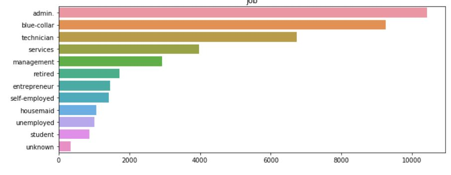
      * Martial
      * Education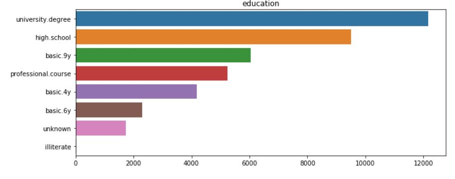
      * Default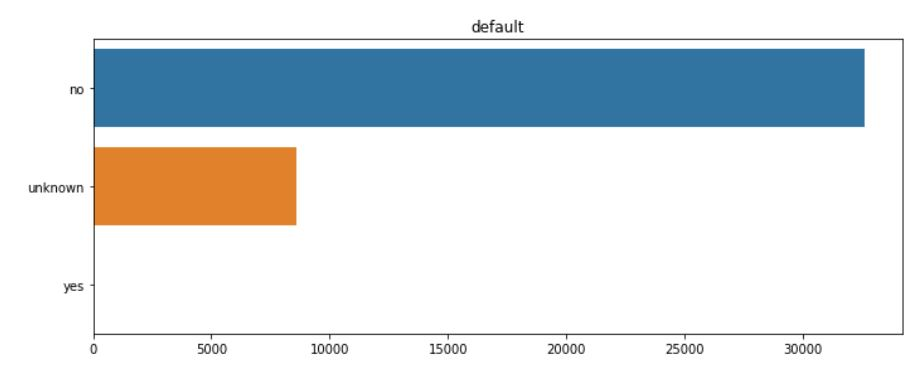
      * Loan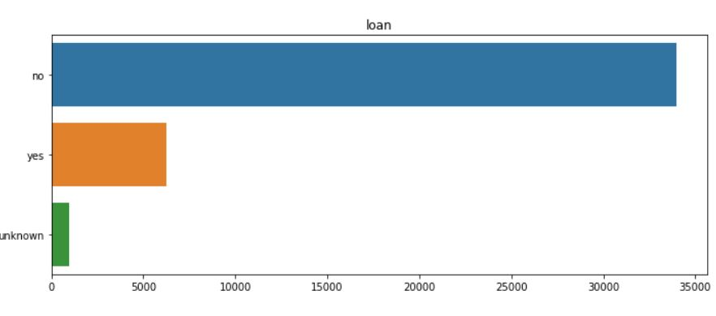
      * Contact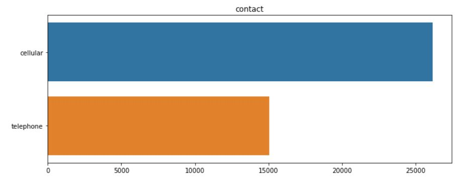
      * Month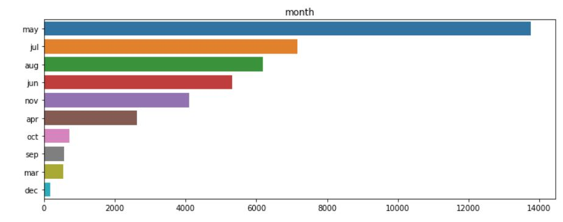
      * Day of week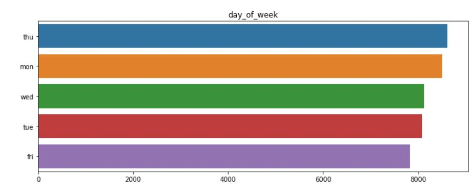
      * Out come
      * Target label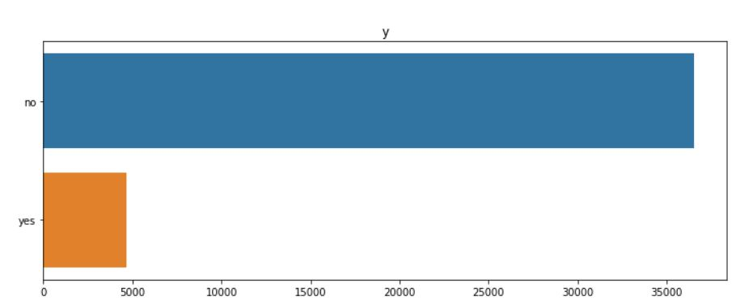

  ### Normalize the Data
  ### Accessing the missing values
  ###### Correlation
Correlation heatmap

### Train and validate

|Model| AUC Score| ROC Curve|
|------------|------------|----------|
|Logistic Regression|0.7900|Logistic Regression!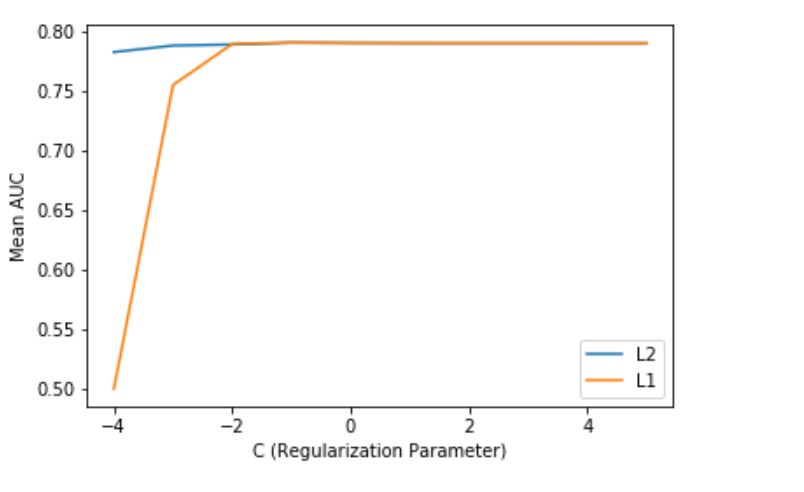|
|Decision Tree |0.7919|Decision Tree 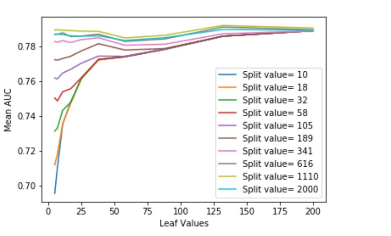|
|Random Forest|0.7979|Random Forest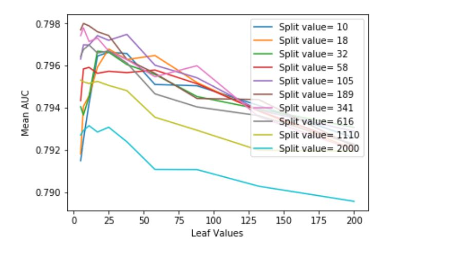|
|Gradient Boosting|0.80065|Gradient Boosting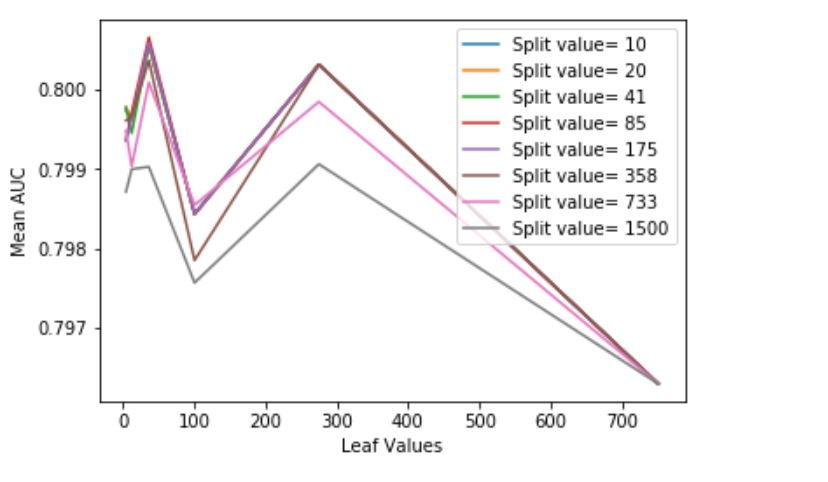|
|Ada Boost|0.8006|AdaBoost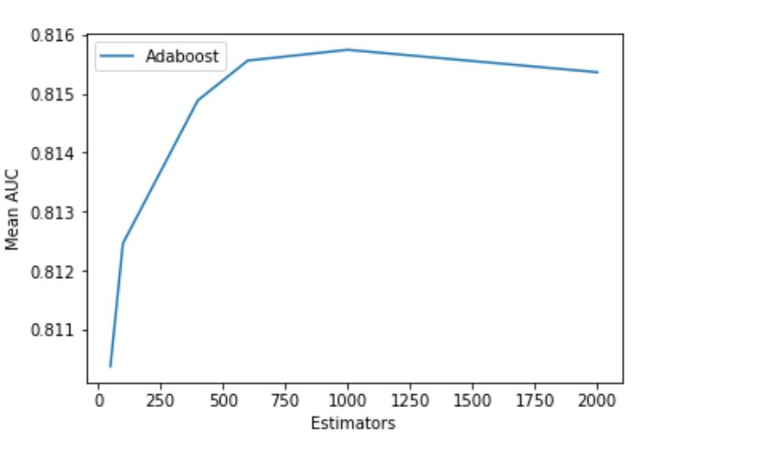|
